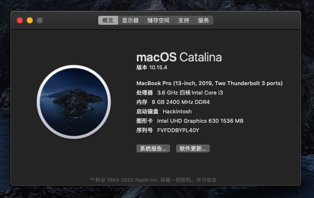

# W650KL 蓝天模具 炫龙毁灭者DC 锋刃版

** 本Clover配置全部借鉴远景论坛[@CeWnHai](http://bbs.pcbeta.com/forum.php?mod=viewthread&tid=1831835&highlight=w650)**，感谢！
## 1、机器配置

- CPU:i38100 (原G4560)
- GPU:HD630 (独显MX150屏蔽)
- 主板型号:H110
- 网卡:DW1820a

## 2、注意
- 原则上W650型号模具通用，但有些硬件不同，请根据个人机型硬件，删除对应驱动Kext，或修改config
- 本配置跟**CeWnHai**区别仅在于USBPort.kext：主板型号不同，对应的USB控制器不相同。于是使用HackinTools定制USBPort.kext。
  感谢[@黑果小兵](https://blog.daliansky.net/Intel-FB-Patcher-USB-Custom-Video.html)的USB定制教程。

## 3、上图

## 4、遇到的坑
- 定制USB前，请将patched中的SSDT-EC、SSDT-UIAC删除，将kext\Other\USBPort.kext删除，接着使用USBInjectAll.kext，然后插拔USB口，判断是否响应。
- 定制完成后，将新的USBPort.kext拷入原来的kext位置，重启即可。
- 定制USB完成后，如果不保留原本SSDT-EC、SSDT-UIAC，会导致笔记本快捷键失效(Fn+F2)，使得在插入外置鼠标时，无法禁用触控板。暂不清楚原因。